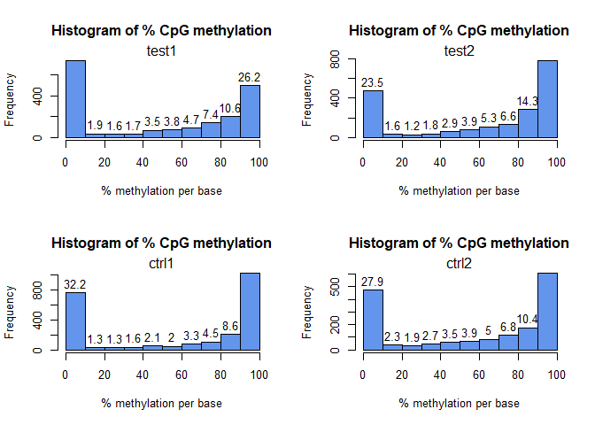
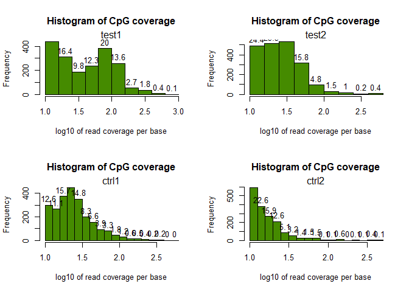
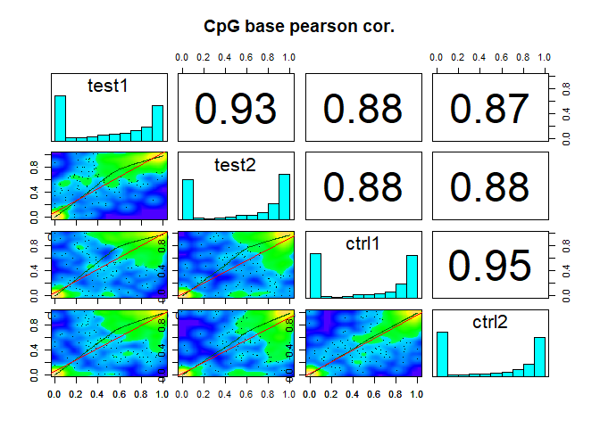
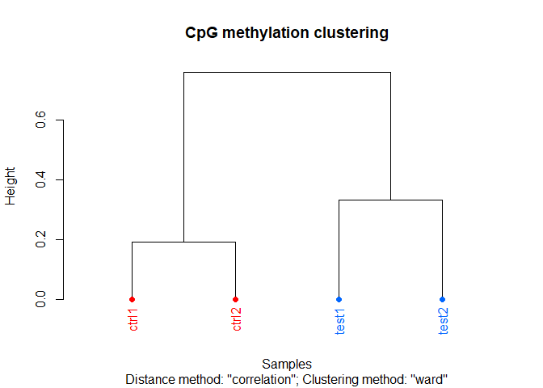
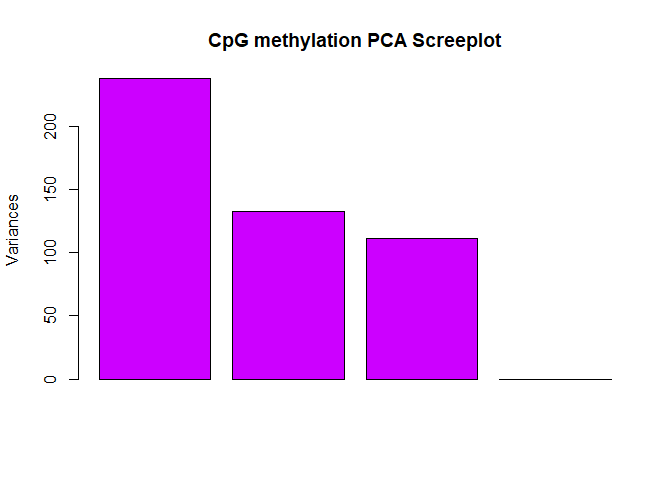
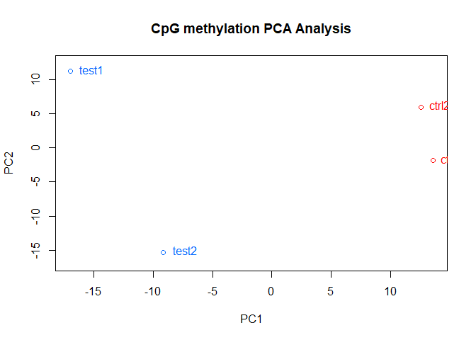
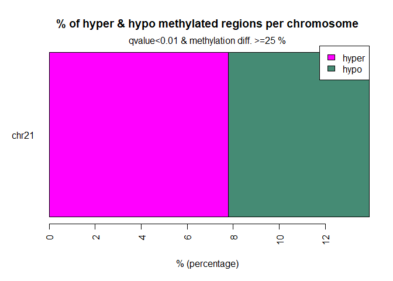
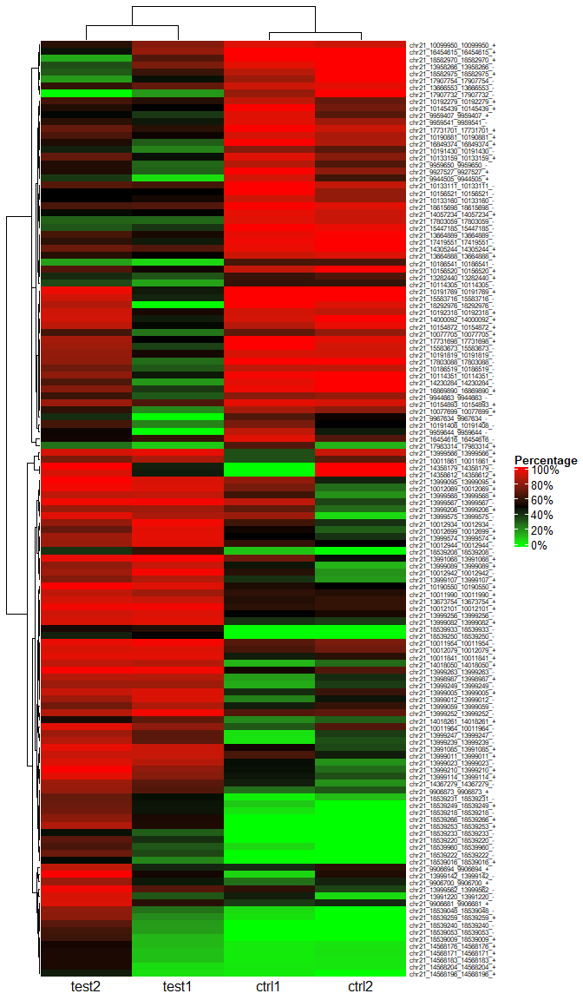

# Processing methylation NGS data with methylKit

**Author**: Xiurui Zhu<br /> **Modified**: 2021-11-16 23:49:55<br />
**Compiled**: 2021-11-16 23:49:58

## Introduction

Next-generation sequencing (NGS) is a powerful tool for analyzing gene
sequences. Methylation sequencing is a special type of NGS technique in
that sodium bisulfate converts unmethylated Cs to Us. In this file, we
will go through the analysis of methylation NGS data according to [a
vignette from methylKit package](https://github.com/al2na/methylKit) in
R.

## Methods

### Data preparation

To facilitate the analyses in the workflow, we need to load the
following packages: `tidyverse`, `magrittr`, `rlang`, `methylKit`,
`ComplexHeatmap` and `genomation`.

``` r
# Define a function to check, install (if necessary) and load packages
check_packages <- function(pkg_name,
                           repo = c("cran", "github", "Bioconductor"),
                           repo_path) {
  repo <- match.arg(repo)
  # Load installed packages
  inst_packages <- installed.packages()
  if (pkg_name %in% inst_packages == FALSE) {
    cat("* Installing: ", pkg_name, ", repo = ", repo, "\n", sep = "")
    switch(repo,
           cran = install.packages(pkg_name),
           github = {
             if ("devtools" %in% inst_packages == FALSE) {
               install.packages("devtools")
             }
             devtools::install_github(repo_path)
           },
           Bioconductor = {
             if ("BiocManager" %in% inst_packages == FALSE) {
               install.packages("BiocManager")
             }
             BiocManager::install(pkg_name)
           })
  } else {
    cat("* Package already installed: ", pkg_name, "\n", sep = "")
  }
  suppressPackageStartupMessages(
    library(pkg_name, character.only = TRUE)
  )
}

# CRAN packages
check_packages("tidyverse", repo = "cran")
purrr::walk(.x = c("magrittr", "rlang"),
            .f = check_packages, repo = "cran")
# github packages
purrr::walk(.x = c("methylKit", "ComplexHeatmap", "genomation"),
            .f = check_packages, repo = "Bioconductor")
#> * Package already installed: tidyverse
#> * Package already installed: magrittr
#> * Package already installed: rlang
#> * Package already installed: methylKit
#> * Package already installed: ComplexHeatmap
#> * Package already installed: genomation
```

Methylation percentage data from 4 “txt” files were loaded. Such input
files may be obtained from [AMP
pipeline](http://code.google.com/p/amp-errbs/) developed for aligning
RRBS reads or from `methylKit::processBismarkAln()` function with “sam”
or “bam” file name(s) as input(s).

``` r
load_file_names <- c("test1.myCpG.txt", "test2.myCpG.txt",
                     "control1.myCpG.txt", "control2.myCpG.txt") %>%
  purrr::map(~ system.file("extdata", .x, package = "methylKit"))

sample_names <- c("test1", "test2", "ctrl1", "ctrl2")
load_data <- load_file_names %>%
  methylKit::methRead(
    sample.id = as.list(sample_names),
    assembly = "hg18",
    treatment = c(1, 1, 0, 0),
    context = "CpG",
    mincov = 10
  )
#> Received list of locations.
#> Reading file.
#> Reading file.
#> Reading file.
#> Reading file.
tibble::glimpse(load_data)
#> Formal class 'methylRawList' [package "methylKit"] with 2 slots
#>   ..@ .Data    :List of 4
#>   .. ..$ :'data.frame':  1904 obs. of  7 variables:
#> Formal class 'methylRaw' [package "methylKit"] with 8 slots
#>   .. ..$ :'data.frame':  2006 obs. of  7 variables:
#> Formal class 'methylRaw' [package "methylKit"] with 8 slots
#>   .. ..$ :'data.frame':  2377 obs. of  7 variables:
#> Formal class 'methylRaw' [package "methylKit"] with 8 slots
#>   .. ..$ :'data.frame':  1697 obs. of  7 variables:
#> Formal class 'methylRaw' [package "methylKit"] with 8 slots
#>   ..@ treatment: num [1:4] 1 1 0 0
```

### Data profiles

We summarize methylation percentage of each sample.

``` r
par(mfrow = c(ceiling(length(load_data) / 2L), 2L))
invisible(
  load_data %>%
    purrr::map(~ {
      methylKit::getMethylationStats(.x, plot = TRUE, both.strands = FALSE)
    })
)
```



We summarize methylation coverage of each sample.

``` r
par(mfrow = c(ceiling(length(load_data) / 2L), 2L))
invisible(
  load_data %>%
    purrr::map(~ {
      methylKit::getCoverageStats(.x, plot = TRUE, both.strands = FALSE)
    })
)
```



### Data merging

We then merge samples for descriptive statistics.

``` r
merge_data <- load_data %>%
  methylKit::unite(destrand = FALSE)
#> uniting...
head(merge_data)
#>     chr   start     end strand coverage1 numCs1 numTs1 coverage2 numCs2 numTs2
#> 1 chr21 9853296 9853296      +        17     10      7       333    268     65
#> 2 chr21 9853326 9853326      +        17     12      5       329    249     79
#> 3 chr21 9860126 9860126      +        39     38      1        83     78      5
#> 4 chr21 9906604 9906604      +        68     42     26       111     97     14
#> 5 chr21 9906616 9906616      +        68     52     16       111    104      7
#> 6 chr21 9906619 9906619      +        68     59      9       111    109      2
#>   coverage3 numCs3 numTs3 coverage4 numCs4 numTs4
#> 1        18     16      2       395    341     54
#> 2        16     14      2       379    284     95
#> 3        83     83      0        41     40      1
#> 4        23     18      5        37     33      4
#> 5        23     14      9        37     27     10
#> 6        22     18      4        37     29      8
```

## Results

### Correlation analysis

``` r
invisible(
  methylKit::getCorrelation(merge_data, plot = TRUE)
)
#>           test1     test2     ctrl1     ctrl2
#> test1 1.0000000 0.9252530 0.8767865 0.8737509
#> test2 0.9252530 1.0000000 0.8791864 0.8801669
#> ctrl1 0.8767865 0.8791864 1.0000000 0.9465369
#> ctrl2 0.8737509 0.8801669 0.9465369 1.0000000
```



### Hierarchical clustering

We perform hierarchical clustering based on the correlation
coefficients.

``` r
invisible(
  methylKit::clusterSamples(
    merge_data,
    dist = "correlation",
    method = "ward",
    plot = TRUE
  )
)
#> The "ward" method has been renamed to "ward.D"; note new "ward.D2"
```



### Principle component analysis (PCA)

We perform PCA on the merged data.

``` r
invisible(
  {
    methylKit::PCASamples(merge_data, screeplot = TRUE)
    methylKit::PCASamples(merge_data, screeplot = FALSE)
  }
)
```



### Finding differentially methylated loci

We calculate differentially methylated loci.

``` r
merge_data_diff <- merge_data %>%
  methylKit::calculateDiffMeth()
#> two groups detected:
#>  will calculate methylation difference as the difference of
#> treatment (group: 1) - control (group: 0)
merge_data_diff_25p <- merge_data_diff %>%
  methylKit::getMethylDiff(difference = 25, qvalue = 0.01)
head(merge_data_diff_25p)
#>      chr   start     end strand       pvalue       qvalue meth.diff
#> 11 chr21 9906681 9906681      + 2.324256e-08 2.172846e-07  44.26808
#> 12 chr21 9906694 9906694      + 2.983628e-04 1.006776e-03  28.85090
#> 13 chr21 9906700 9906700      + 8.405880e-06 4.097059e-05  40.28016
#> 18 chr21 9906873 9906873      + 4.976364e-06 2.603518e-05  47.62876
#> 23 chr21 9927527 9927527      + 1.120126e-07 9.257475e-07 -46.10984
#> 24 chr21 9944505 9944505      + 7.907909e-20 7.515975e-18 -51.01794
```

We plot the percentage of hypo-/hyper-methylated loci per chromosome.

``` r
invisible(
  merge_data_diff %>%
    methylKit::diffMethPerChr(
      plot = TRUE,
      qvalue.cutoff = 0.01,
      meth.cutoff = 25
    )
)
```



### Heatmap of significant methylation loci

We further plot a heatmap of methylation percentage of significant loci
with hierarchical clustering on Pearson’s correlation.

``` r
merge_data_perc <- merge_data %>%
  tibble::as_tibble() %>%
  dplyr::semi_join(
    merge_data_diff_25p %>%
      tibble::as_tibble(),
    by = c("chr", "start", "end", "strand")
  ) %>%
  tidyr::pivot_longer(cols = !c("chr", "start", "end", "strand"),
                      names_to = "metric",
                      values_to = "value",
                      values_drop_na = FALSE) %>%
  tidyr::unite(col = "Feature_Name", chr, start, end, strand, sep = "_") %>%
  dplyr::mutate(sample_idx = metric %>%
                  stringr::str_extract("[0-9]$") %>%
                  as.integer(),
                .after = "metric") %>%
  dplyr::mutate_at("metric",
                   ~ .x %>%
                     stringr::str_replace("[0-9]$", "")) %>%
  dplyr::mutate(Sample_Name = sample_names[sample_idx]) %>%
  tidyr::pivot_wider(id_cols = c("Feature_Name", "Sample_Name"),
                     names_from = "metric",
                     values_from = "value",
                     values_fill = NA_real_) %>%
  dplyr::group_by(Feature_Name, Sample_Name) %>%
  dplyr::summarize(methyl_perc = numCs / (numCs + numTs),
                   .groups = "drop") %>%
  tidyr::pivot_wider(id_cols = "Feature_Name",
                     names_from = "Sample_Name",
                     values_from = "methyl_perc",
                     values_fill = NA_real_) %>%
  tibble::column_to_rownames("Feature_Name") %>%
  as.matrix()

merge_data_heatmap <- merge_data_perc %>%
  ComplexHeatmap::Heatmap(
    col = circlize::colorRamp2(c(0, 0.5, 1),
                               c("#00FF00", "#000000", "#FF0000")),
    name = "Percentage",
    cluster_rows = TRUE,
    cluster_columns = TRUE,
    clustering_method_rows = "average",
    clustering_method_columns = "average",
    clustering_distance_rows = function(x) {
      as.dist(1 - cor(t(x), method = "pearson"))
    },
    clustering_distance_columns = function(x) {
      as.dist(1 - cor(t(x), method = "pearson"))
    },
    row_names_gp = grid::gpar(fontsize = 6),
    column_names_gp = grid::gpar(fontsize = 12),
    column_names_rot = 0,
    column_names_centered = TRUE,
    heatmap_width = grid::unit(1, "native"),
    heatmap_height = grid::unit(2, "native"),
    heatmap_legend_param = list(
      at = seq(0, 1, 0.2),
      labels = scales::percent(seq(0, 1, 0.2))
    )
  )
ComplexHeatmap::draw(merge_data_heatmap)
```



### Methylation annotations

We annotate the genes where differentially methylated loci reside.

``` r
anno_data_gene <- system.file("extdata",
                              "refseq.hg18.bed.txt", 
                              package = "methylKit") %>%
  genomation::readTranscriptFeatures()
#> Reading the table...
#> Calculating intron coordinates...
#> Calculating exon coordinates...
#> Calculating TSS coordinates...
#> Calculating promoter coordinates...
#> Outputting the final GRangesList...
merge_data_diff_25p %>%
  as("GRanges") %>%
  genomation::annotateWithGeneParts(anno_data_gene)
#> Summary of target set annotation with genic parts
#> Rows in target set: 133
#> -----------------------
#> percentage of target features overlapping with annotation:
#>   promoter       exon     intron intergenic 
#>      27.82      15.04      34.59      57.14
#> 
#> percentage of target features overlapping with annotation:
#> (with promoter > exon > intron precedence):
#>   promoter       exon     intron intergenic 
#>      27.82       0.00      15.04      57.14
#> 
#> percentage of annotation boundaries with feature overlap:
#> promoter     exon   intron 
#>     0.29     0.03     0.17
#> 
#> summary of distances to the nearest TSS:
#>    Min. 1st Qu.  Median    Mean 3rd Qu.    Max. 
#>       5     828   45158   52034   94644  313528
#> 
```

We annotate the CpG islands where differentially methylated loci reside.

``` r
anno_data_cpg <- system.file("extdata",
                             "cpgi.hg18.bed.txt", 
                             package = "methylKit") %>%
  genomation::readFeatureFlank()
#> Warning: 'GenomicRangesList' is deprecated.
#> Use 'GRangesList(..., compress=FALSE)' instead.
#> See help("Deprecated")
merge_data_diff_25p %>%
  as("GRanges") %>%
  genomation::annotateWithFeatureFlank(
    anno_data_cpg[["features"]],
    anno_data_cpg[["flanks"]],
    feature.name = "CpGi",
    flank.name = "shores"
  )
#> summary of target set annotation with feature annotation:
#> Rows in target set: 133
#> ----------------------------
#> percentage of target elements overlapping with features:
#>   CpGi shores  other 
#>  48.87   6.77  44.36
#> 
#> percentage of feature elements overlapping with target:
#>   CpGi shores 
#>   0.37   0.20
#> 
```

### Regional distribution of CpG islands per promoter

``` r
promoter_count <- load_data %>%
  methylKit::regionCounts(anno_data_gene[["promoters"]])
promoter_count %>%
  purrr::walk(~ print(head(.x)))
#>     chr    start      end strand coverage numCs numTs
#> 1 chr21 10011791 10013791      -     7953  6662  1290
#> 2 chr21 10119796 10121796      -     1725  1171   554
#> 3 chr21 10119808 10121808      -     1725  1171   554
#> 4 chr21 13903368 13905368      +       10    10     0
#> 5 chr21 14273636 14275636      -      282   220    62
#> 6 chr21 14509336 14511336      +     1058    55  1003
#>     chr    start      end strand coverage numCs numTs
#> 1 chr21 10011791 10013791      -     1229  1066   163
#> 2 chr21 10119796 10121796      -     1455  1105   350
#> 3 chr21 10119808 10121808      -     1455  1105   350
#> 4 chr21 13331357 13333357      +       35    29     6
#> 5 chr21 14141556 14143556      -       27    26     1
#> 6 chr21 14273636 14275636      -      249   215    34
#>     chr    start      end strand coverage numCs numTs
#> 1 chr21 10011791 10013791      -     2541  1654   887
#> 2 chr21 10119796 10121796      -     1493  1182   310
#> 3 chr21 10119808 10121808      -     1493  1182   310
#> 4 chr21 13331357 13333357      +      121   116     5
#> 5 chr21 14141556 14143556      -       23    23     0
#> 6 chr21 14273636 14275636      -       86    81     5
#>     chr    start      end strand coverage numCs numTs
#> 1 chr21 10011791 10013791      -      669   463   206
#> 2 chr21 10119796 10121796      -      630   439   191
#> 3 chr21 10119808 10121808      -      630   439   191
#> 4 chr21 13331357 13333357      +       12    12     0
#> 5 chr21 14141556 14143556      -       16    14     2
#> 6 chr21 14273636 14275636      -      144    45    99
```

## Session info

This file was compiled with the following packages and versions:

``` r
utils::sessionInfo()
#> R version 4.0.5 (2021-03-31)
#> Platform: x86_64-w64-mingw32/x64 (64-bit)
#> Running under: Windows 10 x64 (build 19042)
#> 
#> Matrix products: default
#> 
#> locale:
#> [1] LC_COLLATE=Chinese (Simplified)_China.936 
#> [2] LC_CTYPE=Chinese (Simplified)_China.936   
#> [3] LC_MONETARY=Chinese (Simplified)_China.936
#> [4] LC_NUMERIC=C                              
#> [5] LC_TIME=Chinese (Simplified)_China.936    
#> 
#> attached base packages:
#>  [1] grid      parallel  stats4    stats     graphics  grDevices utils    
#>  [8] datasets  methods   base     
#> 
#> other attached packages:
#>  [1] genomation_1.20.0    ComplexHeatmap_2.4.3 methylKit_1.14.2    
#>  [4] GenomicRanges_1.40.0 GenomeInfoDb_1.24.2  IRanges_2.22.2      
#>  [7] S4Vectors_0.26.1     BiocGenerics_0.34.0  rlang_0.4.11        
#> [10] magrittr_2.0.1       forcats_0.5.1        stringr_1.4.0       
#> [13] dplyr_1.0.7          purrr_0.3.4          readr_2.0.1         
#> [16] tidyr_1.1.3          tibble_3.1.3         ggplot2_3.3.5       
#> [19] tidyverse_1.3.1     
#> 
#> loaded via a namespace (and not attached):
#>   [1] colorspace_1.4-1            rjson_0.2.20               
#>   [3] ellipsis_0.3.2              mclust_5.4.8               
#>   [5] circlize_0.4.13             qvalue_2.22.0              
#>   [7] XVector_0.28.0              GlobalOptions_0.1.2        
#>   [9] fs_1.5.0                    clue_0.3-60                
#>  [11] rstudioapi_0.13             bit64_4.0.5                
#>  [13] fansi_0.4.2                 mvtnorm_1.1-3              
#>  [15] lubridate_1.7.10            xml2_1.3.2                 
#>  [17] splines_4.0.5               R.methodsS3_1.8.1          
#>  [19] impute_1.62.0               knitr_1.29                 
#>  [21] jsonlite_1.7.2              seqPattern_1.20.0          
#>  [23] Rsamtools_2.4.0             gridBase_0.4-7             
#>  [25] broom_0.7.9                 cluster_2.1.1              
#>  [27] dbplyr_2.1.1                png_0.1-7                  
#>  [29] R.oo_1.24.0                 compiler_4.0.5             
#>  [31] httr_1.4.2                  backports_1.1.8            
#>  [33] assertthat_0.2.1            Matrix_1.3-2               
#>  [35] limma_3.44.3                cli_3.0.1                  
#>  [37] htmltools_0.5.0             tools_4.0.5                
#>  [39] coda_0.19-4                 gtable_0.3.0               
#>  [41] glue_1.4.2                  GenomeInfoDbData_1.2.3     
#>  [43] reshape2_1.4.4              Rcpp_1.0.7                 
#>  [45] bbmle_1.0.24                Biobase_2.48.0             
#>  [47] cellranger_1.1.0            vctrs_0.3.8                
#>  [49] Biostrings_2.56.0           nlme_3.1-152               
#>  [51] rtracklayer_1.48.0          xfun_0.15                  
#>  [53] fastseg_1.36.0              rvest_1.0.1                
#>  [55] lifecycle_1.0.0             gtools_3.9.2               
#>  [57] XML_3.99-0.4                zlibbioc_1.34.0            
#>  [59] MASS_7.3-53.1               scales_1.1.1               
#>  [61] vroom_1.5.4                 BSgenome_1.56.0            
#>  [63] hms_1.1.0                   SummarizedExperiment_1.18.2
#>  [65] RColorBrewer_1.1-2          yaml_2.2.1                 
#>  [67] emdbook_1.3.12              bdsmatrix_1.3-4            
#>  [69] stringi_1.4.6               plotrix_3.8-2              
#>  [71] BiocParallel_1.22.0         shape_1.4.5                
#>  [73] pkgconfig_2.0.3             bitops_1.0-6               
#>  [75] matrixStats_0.56.0          evaluate_0.14              
#>  [77] lattice_0.20-41             GenomicAlignments_1.24.0   
#>  [79] bit_4.0.4                   tidyselect_1.1.0           
#>  [81] plyr_1.8.6                  R6_2.4.1                   
#>  [83] generics_0.1.0              DelayedArray_0.14.1        
#>  [85] DBI_1.1.0                   mgcv_1.8-34                
#>  [87] pillar_1.6.2                haven_2.4.3                
#>  [89] withr_2.4.1                 RCurl_1.98-1.2             
#>  [91] modelr_0.1.8                crayon_1.4.1               
#>  [93] KernSmooth_2.23-18          utf8_1.1.4                 
#>  [95] tzdb_0.1.2                  rmarkdown_2.3              
#>  [97] GetoptLong_1.0.5            readxl_1.3.1               
#>  [99] data.table_1.13.0           reprex_2.0.1               
#> [101] digest_0.6.25               numDeriv_2016.8-1.1        
#> [103] R.utils_2.11.0              munsell_0.5.0
```
